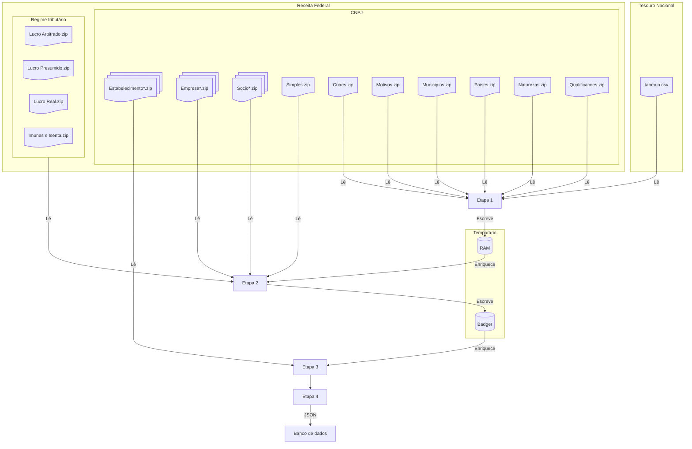

# <abbr title="Extract, Transform, Load">ETL</abbr>

Todos os dados manipulados por esse pacote vem da [Receita Federal](https://dados.gov.br/dados/conjuntos-dados/cadastro-nacional-da-pessoa-juridica-cnpj), salvo o [arquivo do Tesouro Nacional com os códigos dos municípios do IBGE](https://www.tesourotransparente.gov.br/ckan/dataset/lista-de-municipios-do-siafi/resource/eebb3bc6-9eea-4496-8bcf-304f33155282).

### Contexto

Um número de CNPJ tem 3 partes: base, ordem e dígitos verificadores. Isso é importante pois influencia a forma que a Receita Federal disponibiliza os dados, e a forma que o Minha Receita transforma os dados. Por exempo, para o número de CNPJ `19.131.243/0001-97`:

| Base | Ordem | Dígitos verificadores |
|---|---|---|
| `19.131.243` | `0001` | `97` |

Uma mesma pessoa jurídica tem sempre a mesma base, e só varia a ordem (nas filiais dessa mesma pessoa jurídica, por exemplo), e os dígitos verificadores.

### Dados

O grosso dos dados está nos arquivos CSV de estabelecimentos que tem `Estabelecimentos*` como prefixo, e as linhas desses arquivos tem um número de CNPJ completo como chave.

#### Dados que tem a base do CNPJ (apenas 8 primeiros dígitos do número de CNPJ) como chave

* Arquivos com o prefixo `Empresas*` tem o básico dos dados, como razão social, natureza jurídica e porte.
* Arquivos com o prefixo `Socios*` tem informações sobre o quadro societário de cada pessoa jurídica.
* Arquivo `Simples.zip` tem informações sobre adesão das pessoas jurídicas ao Simples e MEI.

#### Dados que tem o CNPJ completo como chave

* Regime tributário (`Lucro Arbitrado.zip`, `Lucro Presumido.zip`, `Lucro Real.zip` e `Imunes e Isentas.zip`)

#### Dados com outras chaves

Na leitura desses arquivos existem campos que contém um código numérico, mas sem descrição do significado (por exemplo, temos o código 9701 para o município de Brasília). Esses arquivos são chamados de tabelas de _look up_:

* Arquivo `Cnaes.zip` com descrição dos CNAEs
* Arquivo `Motivos.zip` com descrição dos motivos cadastrais
* Arquivo `Municipios.zip` com o nome dos municípios
* Arquivo `Paises.zip` com o nome dos países
* Arquivo `Naturezas.zip` com o nome da natureza jurídica
* Arquivo `Qualificacoes.zip` com a descrição da qualificação de cada pessoa do quadro societário
* Arquivo do Tesouro Nacional com os códigos dos municípios do IBGE

## Estratégia de carregamento dos dados

A etapa de transformação dos dados começa criando armazenamentos de chave e valor, com acesso rápido, para completar os dados dos CSVs principais, `Estabelecimentos*`. Isso é feito em memória para os dados que tem outras chaves, e em disco para os dados que tem como chave a base do CNPJ ou o CNPJ completo.

A partir daí, cada linha dos `Estabelecimentos*` é lida, enriquecida com esses pares de chave e valor armazenados anteriormente, e então enviada para o banco de dados.

| Etapa | Descricão | Armazenamento |
|:-:|---|---
| 1 | Armazena pares de chave e valor em memória para os dados de: `Cnaes.zip`, `Motivos.zip`, `Municipios.zip`, `Paises.zip`, `Naturezas.zip`, `Qualificacoes.zip` e códigos dos municípios do IBGE | Em memória |
| 2 | Armazena pares de chave e valor em disco para os dados de: `Empresas*` (já enriquecidas com dados de `Cnaes.zip`, `Motivos.zip`, `Municipios.zip`, `Paises.zip`, `Naturezas.zip`, `Qualificacoes.zip` e códigos dos municípios do IBGE), `Socios*` (já enriquecidos com pares de chave e valor de `Qualificacoes.zip`), `Simples.zip`, `Lucro Arbitrado.zip`, `Lucro Presumido.zip`, `Lucro Real.zip` e `Imunes e Isentas.zip` | [Badger](https://dgraph.io/docs/badger/) |
| 3 | Lê os arquivos `Estabelecimentos*` e os enriquece com os dados das etapas anteriores | Em memória |
| 4 | Converte os dados para JSON e armazena o resultado no banco de dados | Banco de dados |

